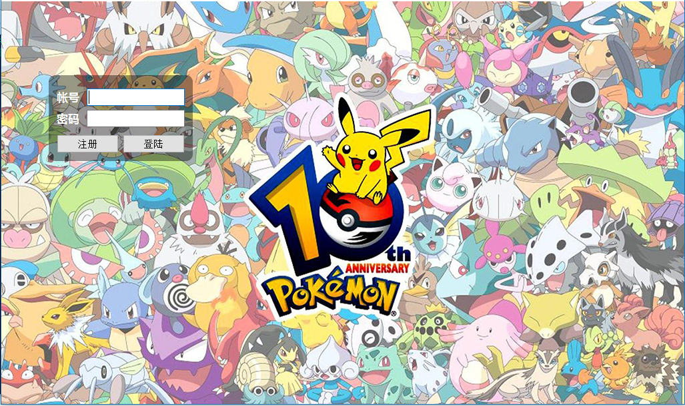
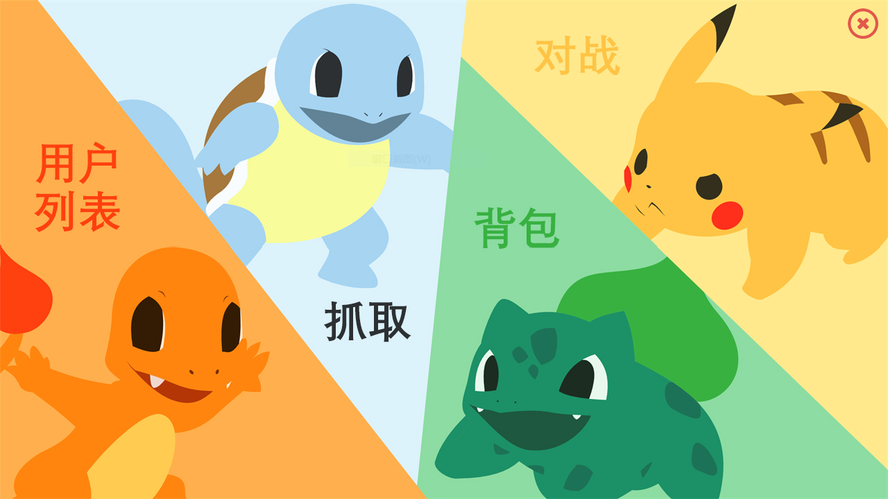
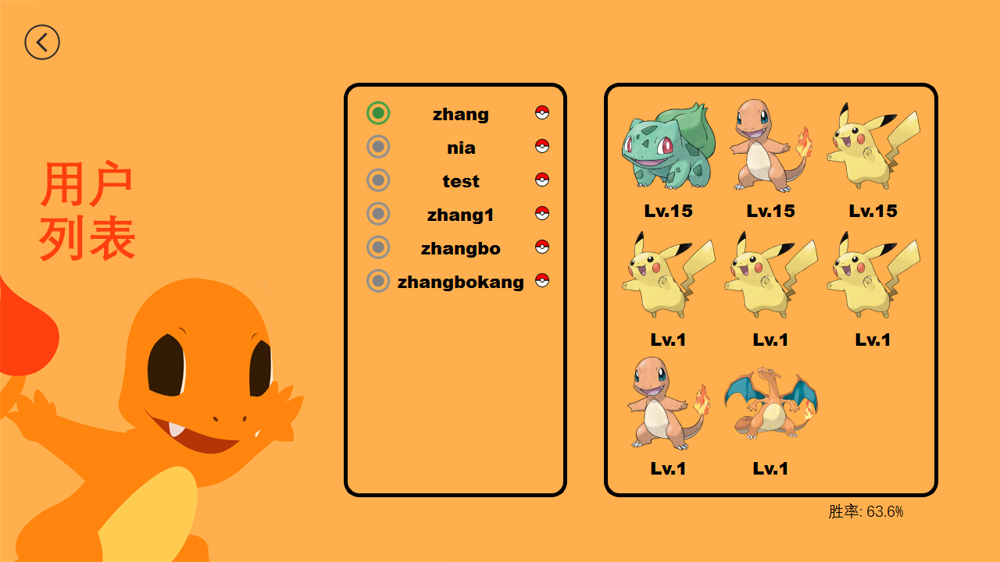
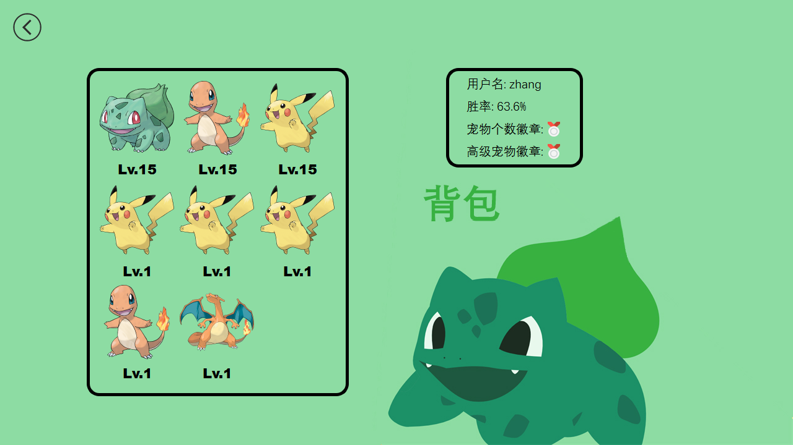
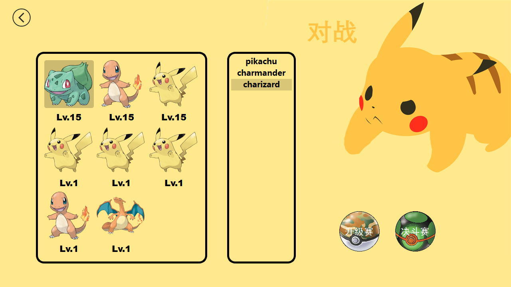
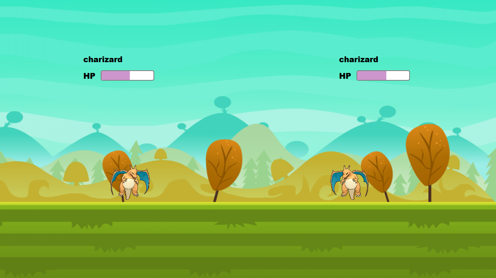
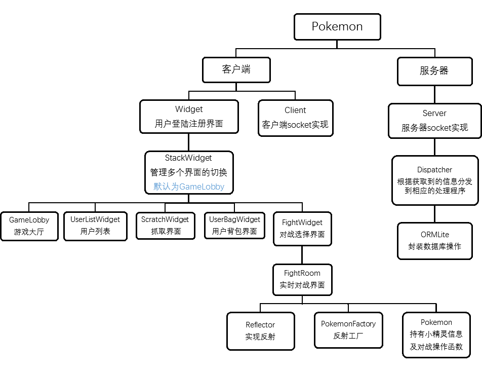

# Pokemon

宠物小精灵人机对战游戏

## 依赖环境

-   **C++ 11** Support
    -   MSVC >= 14 (2015)
    -   GCC >= 5
-   **SQLite 3** (include in *./include*)
-   **QT5**


## 特性

-  使用C++11编写


-  实现了简单反射，可以通过GetClassByName通过字符串获得相应类的对象


-  使用反射工厂来创建Pokemon对象，配合多态大大简化代码并提供扩展性


-  通过宏注入获得类元数据，实现ORM（对象关系模型）封装SQLite数据库操作，运用访问者模式来自动生成SQL语句


-  使用JSON提高协议的可扩展性


-  良好的人机交互界面，支持多用户同时在线


-  健全的错误恢复处理


## 界面设计

##### 登陆及注册




##### 游戏主界面




##### 用户列表




##### 抓取


##### 背包




##### 对战




##### 实时对战（动画）




##### 战斗结束


## 框架设计




## 协议设计

##### 游戏通讯协议基于json，以达到良好的扩展性

```json
登陆:
{"define" : LOG_IN, "username" : username, "password" : password}
{"define" : LOG_IN_SUCCESS/LOG_IN_FAIL_WP/LOG_IN_FAIL_AO/SERVER_ERROR}

注册:
{"define" : SIGN_UP, "username" : username, "password" : password}
{"define" : SIGN_UP_SUCCESS/SIGN_UP_FAIL/SERVER_ERROR}

获取在线用户列表:
{"define" : GET_ONLINE_LIST}
{"define" : QUERY_SUCCESS/SERVER_ERROR, "info" : [list]}

获取离线用户列表:
{"define" : GET_OFFLINE_LIST}
{"define" : QUERY_SUCCESS/SERVER_ERROR, "info" : [list]}

获取用户背包内容:
{"define" : GET_USER_BAG, "username" : username}
{"define" : QUERY_SUCCESS, 
 "info" : [{"id" : id,
            "name" : name,
            "level" : level,
            "exp" : exp,
            "type" : type,
            "atttackPoint" : ap,
            "defensePoint" : dp,
            "healthPoint" : hp,
            "attackFrequence" : af,
            "property" : property 
           }]}
{"define" : SERVER_ERROR}

获取用户成就:
{"define" : GET_USER_ACH}
{"define" : QUERY_SUCCESS, 
 "rate" : rate, 
 "sum_ach" : sum , 
 "advance_ach" : advance_sum
}
{"define" : SERVER_ERROR}

获取对战精灵列表:
{"define" : GET_POKEMON_LIST}
{"define" : QUERY_SUCCESS, "info" : [list]}
{"define" : SERVER_ERROR}

获取对战精灵信息:
{"define" : GET_POKEMON_INFO}
{"define" : QUERY_SUCCESS, 
 "info" : {"name" : name,
          "type" : type,
          "attackPoint" : ap,
          "defensePoint" : dp,
          "healthPoint" : hp,
          "attackFrequence" : af,
          "property" : property,
          "exp" : exp}
}
{"define" : SERVER_ERROR}

反馈对战胜利:
{"define" : GAME_WIN, 
 "get" : acquire_pokemon,	#对战胜利小精灵的名字
 "name" : user_pokemon,		#用户对战小精灵的名字
 "type": type, 
 "attackPoint" : ap,
 "defensePoint" : dp,
 "healthPoint" : hp,
 "attackFrequence" : af,
 "property" : property,
 "level" : level,
 "exp" : exp,
 "id" : id					#小精灵信息在数据库中的唯一id
}
{"define" : ACCEPT/SERVER_ERROR}

反馈对战失败:
{"define" : GAME_LOSE, "isLose" : true/false}
if isLose == true:
	{"define" : ACCEPT, 
     "info" : [{"id" : id,
                "name" : name,
                "level" : level,
                "exp" : exp,
                "type" : type,
                "atttackPoint" : ap,
                "defensePoint" : dp,
                "healthPoint" : hp,
                "attackFrequence" : af,
                "property" : property 
               }]
    }
else 
	{"define" : ACCEPT/SERVER_ERROR}

反馈损失小精灵:
{"define" : LOSE_POKEMON, "id" : id}
{"define" : ACCEPT/SERVER_ERROR}

随机获得一个新小精灵:
{"define" : GET_ONE_POKEMON}
{"define" : ACCEPT, "name" : name}
{"define" : SERVERE_ERROR}
```


## 结构说明

### 通用

###**`Connor_Socket::Socket(socket.h)`**

##### 完成WSA最基本的初始化，加载库文件，以及释放相关资源

```C++
#define DEFAULT_BUFLEN 10000        // Socket传输缓冲区大小

#define CLIENT_PORT 5150            // 客户端连接端口
#define SERVER_PORT 2222            // 服务器监听端口

                                    // 单机模式下都指向localhost
#define CLIENT_ADDR "127.0.0.1"     // 客户端IP地址
#define SERVER_ADDR "127.0.0.1"     // 服务器IP地址
```


### **`Reflector(reflector.h)`**

##### 反射类，维护类名与之对应构造函数的map

定义：

```C++
// 定义生成Pokemon对象的函数指针
typedef Pokemon* (*PTRCreateObject)(std::string, unsigned int, unsigned int, Attribute, int);

// 新建全局函数以new类对象，模拟反射
#define REGISTER(_CLASS_NAME_)                                          \
_CLASS_NAME_* Create##_CLASS_NAME_(std::string name, unsigned int level,\
    unsigned int exp, Attribute attribute, int id)                      \
{                                                                       \
    return new _CLASS_NAME_(name, level, exp, attribute, id);           \
}                                                                       \
                                                                        \
RegisterAction createRegister##_CLASS_NAME_(                            \
    #_CLASS_NAME_, (PTRCreateObject)Create##_CLASS_NAME_)
```

成员函数：

```C++
// 使用单例模式，获得Reflector实例
// @return:
//      Reflector唯一对象的引用
static Reflector& GetInstance()
{
  static Reflector instance;
  return instance;
}

// 通过类名获得类的构造函数
// @param:
//      className 需要获得的类名
// @return:
//      生成相应类的函数指针
PTRCreateObject GetClassByName(std::string className);


// 将类名和构造函数注册到map中
// @param:
//      className 需要注册的类名
//      method 生成相应类的函数指针
void RegistClass(std::string className, PTRCreateObject method);

// 隐藏Reflector的构造函数，单例模式只运行使用GetInstance获得Reflector唯一实例
Reflector() {}
```

成员变量：

```C++
// 类名与之对应构造函数的map
std::map<std::string, PTRCreateObject> _classMap;
```


### **`RegisterAction(reflector.h)`**

##### 注册行为类，通过构造函数以实现自动向Reflector注册

成员函数：

```C++
// 将类与回调函数注册到Reflector
// @param:
// 		className 类名
// 		PtrCreatFn 创建相应类的回调函数
RegisterAction(std::string className,PTRCreateObject PtrCreateFn);
```


### **`PokemonFactory(pokemonfactory.h)`**

##### 产生小精灵对象的工厂，通过多态获得小精灵对象

成员函数：

```C++
// 产生对战电脑的小精灵实体
// @param:
//      name 对战小精灵的名字
//      client 与服务器连接的socket指针
// @return:
//      小精灵对象指针
static Pokemon* CreateComputer(std::string name, Connor_Socket::Client *client);

// 产生用户的小精灵实体
// @param:
//      str 用户小精灵的序列化数据，包含各种属性
// @return:
//      小精灵对象指针
static Pokemon* CreateUser(std::string str);
```


### **`Pokemon(pokemon.h)`**

##### 产生小精灵对象的工厂，通过多态获得小精灵对象

定义：

```C++
// 获得对象运行时多态类型
// 多编译器支持
#ifdef __GNUC__
#include <cxxabi.h>
#define GET_CLASS_TYPE(_OBJECT_)        \
    std::string(abi::__cxa_demangle(typeid(_OBJECT_).name(), nullptr, nullptr, nullptr))
#elif _MSC_VER && !__INTEL_COMPILER
#include <typeinfo>

#define GET_CLASS_NAME(_OBJECT_)        \
    std::string(typeid(_OBJECT_).name())
#define GET_CLASS_TYPE(_OBJECT_)        \
    GET_CLASS_NAME(_OBJECT_).substr(GET_CLASS_NAME(_OBJECT_).find("class ") + 6, \
    GET_CLASS_NAME(_OBJECT_).length() - 6)

#else
#define GET_CLASS_TYPE(_OBJECT_)        \
    std::string(typeid(_OBJECT_).name())

#endif

#define CRTICAL_RATE 0.1    // 暴击概率
#define MISS_RATE 0.2       // 闪避概率

// 小精灵主属性类别
enum class Type
{
    Strength,               //高攻击
    Tanker,                 //高生命值
    Defensive,              //高防御
    Swift,                  //低攻击间隔
};

// 小精灵属性
typedef struct struct_Attribute
{
    Type type;              // 小精灵主属性类型
    int attackPoint;        // 攻击力
    int defensePoint;       // 防御力
    int healthPoint;        // 生命值
    int attackFrequence;    // 攻击间隔
}Attribute;

// 经验值列表
const int LEVEL_EXP_LIST[15] = {0, 100, 250, 500, 800, 1200, 1800, 2500,
                                3300, 4500, 6000, 7000, 8000, 9000, 10000};

```

成员函数：

```C++
// 各种获取属性函数
Type GetType() const { return _attribute.type; }
std::string GetName() const { return _name; }
int GetLevel() const { return _level; }
unsigned long GetExp() const { return _exp; }
int GetAttackPoint() const { return _attribute.attackPoint; }
int GetHealthPoint() const { return _attribute.healthPoint; }
int GetDefensePoint() const { return _attribute.defensePoint; }
int GetAttackFrequence() const { return _attribute.attackFrequence; }
int GetHp() const { return _hp; }
int GetId() const { return _id; }

// 判断是否最近一次攻击为暴击
bool IsCritical() const { return _critical; }

// 小精灵受伤函数
// 小精灵真正受到的伤害 = （damage-小精灵的防御值） * 随机系数
// 同时有几率闪避
// @param:
//      damage 受到的伤害
// @return:
//      小精灵是否死亡
virtual bool Hurt(int damage);

// 小精灵攻击函数
// @param:
//      opPokemon 攻击小精灵的指针
// @return:
//      攻击造成的伤害
virtual int Attack(Pokemon * opPokemon) = 0;

// 根据获得的经验增加经验值并自动升级，返回是否升级
// @param:
//      exp 小精灵获得的经验值
// @return:
//      小精灵是否升级
virtual bool Upgrade(int exp);

// 小精灵升级时各属性的成长
// @param:
//		master 小精灵主属性
virtual void Grow(int *master);

// 在攻击、防御、升级时有一定的随机性
// @return:
//		产生随机的比例系数(0~1)
virtual double Bonus();
```

成员变量：

```C++
// 精灵名字
std::string _name;
// 等级
int _level;
// 经验值
unsigned long _exp;
// 各种属性
Attribute _attribute;
// 对战时的实时血量
int _hp;
// 在数据库中对应的唯一id
int _id;
// 暂存最近一次攻击是否暴击
bool _critical;
```


### 客户端

###**`Connor_Socket::Client(client.h)`**

##### 继承于Socket类，封装winsock，管理socket的发送与接受信息

成员函数：

```C++
// 默认构造函数
// 委托到带名字的构造函数，传参为UNKOWN
Client() : Client("UNKNOWN") { }

// 带名字的构造函数，表明与该socket绑定的用户名
// @param:
//      name 用户名
Client(string name);

// 注册、登陆时使用的函数
// 建立与服务器的连接
// @param:
//      requestInfo json序列化后请求信息
// @return:
//      json序列化后的返回信息
// @exception:
// 		Server关闭连接/发送失败，抛出 runtime_error；
std::string Connect(std::string requestInfo);

// 建立连接后使用此函数向服务器发送数据
// @param:
//      requestInfo json序列化后请求信息
// @return:
//      json序列化后的返回信息
// @exception:
// 		Server关闭连接/发送失败，抛出 runtime_error；
std::string Send(std::string requestInfo);

// 关闭与服务器的连接
void Close();

// 获取该client绑定的用户名
// @return:
//      用户名
std::string GetUserName();
```

成员变量：

```C++
// 与服务器通信的socket
SOCKET _connectSocket;
// 服务器的地址信息
SOCKADDR_IN _serverAddr;
// 用户名
std::string _username;
```


###**`Widget(widget.h)`**

##### 登录及注册界面

成员函数：

```C++
// 登陆
void Login();

// 注册
void Signup();

// 初始化UI界面
void InitUi();

// 初始化信号槽
void InitConnect();
```

成员变量：

```C++
// 该widget的ui界面指针
Ui::Widget *ui;
// 与服务器连接的socket指针
Connor_Socket::Client *_client;
```


### **`StackWidget(stackwidget.h)`**

##### 管理多个视图的切换

成员函数：

```C++
// 刷新用户列表信号
void refreshUserList();

// 刷新用户背包信号
void refreshBag();

// 刷新对战界面信号
void refreshFight();

// 设置当前显示的视图
// index = 0 游戏主界面
// index = 1 用户列表界面
// index = 2 抓取界面
// index = 3 用户背包界面
// index = 4 对战选择界面
// @param:
//      index 视图的编号
void SetCurrentIndex(int index);

// 返回到主界面
void BackToLobby();

// 初始化UI界面
void InitUi();

// 初始化信号槽
void InitConnect();
```

成员变量：

```C++
// 该widget的ui界面指针
Ui::StackWidget *ui;
// 与服务器连接的socket指针
Connor_Socket::Client *_client;
// 管理多个视图切换的stacklayout
QStackedLayout *_stackLayout;
// 各个分视图指针
GameLobby *_gameLobby;
UserListWidget *_userListWidget;
BagWidget *_bagWidget;
FightWidget *_fightWidget;
ScratchWidget *_scratchWidget;
```


### **`GameLobby(gamelobby.h)`**

##### 游戏主界面，包括进入四个功能界面的入口

成员函数：

```C++
// 鼠标点击在相应的区域信号
void clicked(int type);

// 关闭程序信号
void closeAll();

// 登出
void LogOut();

// 重载鼠标点击事件，对四个不规则区域监测鼠标点击事件
void mousePressEvent(QMouseEvent *event);

// 初始化UI界面
void InitUi();

// 初始化信号槽
void InitConnect();
```


### **`UserListWidget(userlistwidget.h)`**

##### 用户列表界面，包括查看在线用户和所有用户的背包及胜率

成员函数：

```C++
// 返回到主界面信号
void back();

// 设置用户列表界面的内容
void SetUserList();

// 显示背包内容
// @param:
//      username 要查看背包的所属用户
void ShowBag(QString username);

// 初始化UI界面
void InitUi();

// 初始化信号槽
void InitConnect();
```

成员变量：

```C++
// 该widget的ui界面指针
Ui::UserListWidget *ui;
// 与服务器连接的socket指针
Connor_Socket::Client *_client;
// 在选择用户背包按钮的mapper
QSignalMapper *_signalMapper;
```


### **`ScratchWidget(scratchwidget.h)`**

##### 抓取界面，点击精灵球有机率随机获得小精灵

成员函数：

```C++
// 返回到主界面信号
void back();

// 重载事件过滤器
// 当鼠标移动到精灵球上对其实现震动动画
bool eventFilter(QObject *watched, QEvent *event);

// 初始化UI界面
void InitUi();

// 初始化信号槽
void InitConnect();

// 该widget的ui界面指针
Ui::ScratchWidget *ui;
// 与服务器连接的socket指针
Connor_Socket::Client *_client;
```

成员变量：

```C++
 // 该widget的ui界面指针
Ui::ScratchWidget *ui;
// 与服务器连接的socket指针
Connor_Socket::Client *_client;
```


### **`BagWidget(bagwidget.h)`**

##### 用户背包界面，包括查看背包内小精灵属性和用户胜率及成就的显示

成员函数：

```C++
// 返回到主界面信号
void back();

// 设置背包界面的内容
void SetBag();

// 初始化UI界面
void InitUi();

// 初始化信号槽
void InitConnect();
```

成员变量：

```C++
// 该widget的ui界面指针
Ui::BagWidget *ui;
// 与服务器连接的socket指针
Connor_Socket::Client *_client;
```


### **`FightWidget(fightwidget.h)`**

##### 对战选择界面，包括选择用户精灵和对战的电脑精灵

成员函数：

```C++
// 返回到主界面信号
void back();

// 设置背包界面的内容
void SetBag();

// 对战开始，构建fightroom
// @param:
//      isLose 对战失败用户是否会损失小精灵
void FightBegin(bool isLose);

// 重载事件过滤器，监测鼠标对背包小精灵label的点击
bool eventFilter(QObject *watched, QEvent *event);
```

成员变量：

```C++
// 该widget的ui界面指针
Ui::FightWidget *ui;
// 与服务器连接的socket指针
Connor_Socket::Client *_client;
// 父对象指针
QWidget *_parent;
// 选中出战的小精灵
QObject *_select;
```


### **`FightRoom(fightroom.h)`**

##### 实时对战界面，包括小精灵打斗动画和血量显示以及实时计算

成员函数：

```C++
// 开始对战
void Fight();

// 重载关闭事件
void FightRoom::closeEvent(QCloseEvent *event);

// 小精灵普通攻击信号
void attack(QLabel *, QLabel *);

// 小精灵特殊攻击信号
void attack_SP(std::pair<Pokemon *, QLabel *> *, std::pair<Pokemon *, QLabel *> *);

// 游戏结束信号
void over(Pokemon *);

// 小精灵受伤害信号
void hurt(QLabel *attacker, QLabel *suffer);

// 窗口关闭信号
void isClosed();

// 清除掉血文字信号
void clearText();

// 隐藏招式标签信号
void hideLabel();

// 设置普通攻击动画
// @param:
//      attacker GUI中攻击方的Label指针
//      suffer GUI中被攻击方的Label指针
void setAnimation(QLabel *attacker, QLabel *suffer);

// 设置特殊攻击动画
// @param:
//      attacker 攻击方的小精灵对象指针和GUI中的显示Label
//      suffer  被攻击方的小精灵对象指针和GUI中的显示Label
void setAnimation_SP(std::pair<Pokemon *, QLabel *> *attacker,
                     std::pair<Pokemon *, QLabel *> *suffer);
// 对战完成
// @param:
//      winner 胜利小精灵的对象指针
void GameComplete(Pokemon *winner);

// 更新双方血量
// @param:
//      attacker GUI中攻击方的Label指针
//      suffer GUI中被攻击方的Label指针
void UpdateHp(QLabel *attacker, QLabel *suffer);

// 设置掉血数值
void setText();

// 设置招式Label
void setLabel();

// 选择损失的小精灵
void Choose(int);

// 初始化UI界面
void InitUi();

// 初始化信号槽
void InitConnect();
```

成员变量：

```C++
// 该widget的ui界面指针
Ui::FightRoom *ui;
// 与服务器连接的socket指针
Connor_Socket::Client *_client;
// 对战用户方的小精灵对象指针和GUI中的显示Label
std::pair<Pokemon *, QLabel *> _fighter;
// 对战电脑方的小精灵对象指针和GUI中的显示Label
std::pair<Pokemon *, QLabel *> _againster;
// 该场对战用户失败是否会损失小精灵
bool _isLose;
// 在选择损失小精灵所用的信号mapper
QSignalMapper *_signalMapper;
// 标识用户在对战中是否中途退出
bool _quit;
```


### 服务器

### **`Connor_Socket::Server(server.h)`**

##### 继承于Socket类，封装winsock，管理socket的发送与接受信息

成员函数：

```C++
// 构造函数，打开监听接口等待请求
Server();

// 查询用户是否在线
// @param:
//      username 需要查询的用户名
//      connection 与该用户名绑定的socket
// @return:
//      是否在线
bool Online(std::string username, SOCKET connection);

// 将某用户从在线列表移除
// @param:
//      username 需要移除的用户名
void Offline(std::string username);

// 获得在线用户列表
// @return:
//      装载有所有在线用户名的list
std::list<std::string> GetOnlineList();
```

成员变量：

```C++
// 监听客户端访问的socket
SOCKET _listeningSocket;

// 地址信息
SOCKADDR_IN _serverAddr;

// 持有与各个客户端保持通信的线程
std::vector<std::thread> _socketThreads;

// 持有用户名相对应的socket链接
std::unordered_map<std::string, SOCKET> _sockets;

// 连接到服务器的客户端数
size_t _count;
```


### **`Dispatch(dispatch.h)`**

##### 继承于Socket类，封装winsock，管理socket的发送与接受信息

成员函数：

```C++
// 传入SOCKET和Server的构造函数
// @param:
//      connection  与相应客户端建立的socket连接
//      parent      server对象指针
Dispatcher(SOCKET &connection, Connor_Socket::Server *parent);

// 根据请求信息，分发到相应的函数处理请求
// @param:
//      requestInfo json序列化后请求信息
// @return:
//      json序列化后的返回信息
std::string Dispatch(json requestInfo);

// 登陆处理逻辑
json LoginHandle(json&);

// 注册处理逻辑
json SignupHandle(json&);

// 获取在线用户列表处理逻辑
json OnlineListHandle(json &);

// 查看用户背包处理逻辑
json UserBagHandle(json &);

// 获取离线用户列表处理逻辑
json OfflineListHandle(json &);

// 获取用户成就逻辑
json UserAchievementHandle(json &);

// 获取对战精灵列表处理逻辑
json PokemonListHandle(json &);

// 获取对战精灵信息处理逻辑
json PokemonInfoHandle(json &);

// 对战胜利处理逻辑
json GameWinHandle(json &);

// 对战失败处理逻辑
json GameLoseHandle(json &);

// 损失小精灵处理逻辑
json LosePokemonHandle(json &);

// 为用户随机分发一个宠物小精灵
// @param:
//      username 获得小精灵的用户名
// @return:
//      获得小精灵的名字
std::string DispatchPokemon(std::string username);

// 与该Dispatch绑定用户登出
void Logout();

// 获取Dispatcher的内部状态
int getState();
```

成员变量：

```C++
// 代表用户处于什么状态，如在线空闲或对战
int _state;

// 与dispatcher绑定的socket连接
SOCKET _connection;

// 与socket连接绑定的用户名
std::string _username;

// server指针，以访问server维护的在线列表
Connor_Socket::Server *_parent;
```


